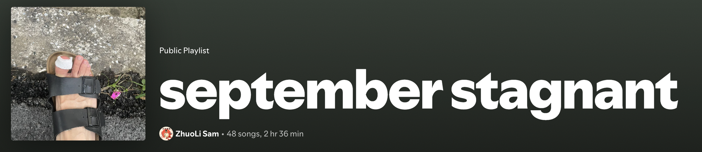

I'm sharing some music works that I enjoyed the most, throughout different seasons in 2024.

Why am I writing this? While Spotify Wrapped provide a statistics summarising our music listening records, I believe there're much more beyond just numbers about the music we listened. I want to share what made me listened to them, and why I liked listening to them. 


[paris thielton on X: "Spotify wrapped is people waiting all winter for like 2 sql queries that’s wild"](https://x.com/contrarianbimbo/status/1864384673889309000)

### July

July was the month I had worked a month, for the first adult permanent job I had, after graduating college. For the first time in my life, I was supporting myself, truly living independently, and enjoying my free little life. Every weekend I would hike through hills, explore parks, and wander through art exhibitions, immersing myself in the vibrancy of nature, life, and art. I also got my first camera, and captured all those beauty of the places I discovered, preserving those moments of newfound freedom and joy.

It's the same time I discovered [Bossa nova](https://en.wikipedia.org/wiki/Bossa_nova) . I wrote this after weeks listening to them:
![[Pasted image 20241221160432.png]]

Bossa nova has a magical power, especially the Brazilian kind. To me, Brazilians are always portrayed as warm, friendly, and full of life. Their vibrant culture is deeply infused into their music. Brazilian bossa nova makes me feel alive—it’s impossible not to move and groove to its rhythms. Life feels ten times more enjoyable when you put on Brazilian songs. 

They say learning a language is like unlocking the culture it represents. I’ve felt a strong urge to learn Portuguese, just to experience the joy and zest for life that seems to radiate from it. Put it on my bucket list. 

Some album I listened over and over. They're mostly from last decade, but classics never go out of style. I believe these albums can bring you some joy to life, and perhaps help you appreciate and celebrate the small happiness sprinkled throughout your daily lives.

My happiest moments in 2024 were all made in August.
<iframe style="border-radius:12px" src="https://open.spotify.com/embed/album/2Vyh5vI7IPQ6yMcIfYcLFp?utm_source=generator" width="100%" height="152" frameBorder="0" allowfullscreen="" allow="autoplay; clipboard-write; encrypted-media; fullscreen; picture-in-picture" loading="lazy"></iframe>

[*Romance Latino vol.3* - Lisa Ono](https://open.spotify.com/album/2Vyh5vI7IPQ6yMcIfYcLFp?si=kIct51LNRninx01iB53rog)

 

<iframe style="border-radius:12px" src="https://open.spotify.com/embed/album/2A8A15YTJJEXGUNAJRKMPW?utm_source=generator" width="100%" height="152" frameBorder="0" allowfullscreen="" allow="autoplay; clipboard-write; encrypted-media; fullscreen; picture-in-picture" loading="lazy"></iframe>

[*Inédito* - Antônio Carlos Jobim](https://open.spotify.com/album/2A8A15YTJJEXGUNAJRKMPW?si=ULUTDPmdQ92U6aVCL9NX4w)

 

<iframe style="border-radius:12px" src="https://open.spotify.com/embed/album/73ZRKdD3Ds43IjHrhKgucY?utm_source=generator" width="100%" height="152" frameBorder="0" allowfullscreen="" allow="autoplay; clipboard-write; encrypted-media; fullscreen; picture-in-picture" loading="lazy"></iframe>

[*Gets/Gilberto* - Stan Getz,João Gilberto](https://open.spotify.com/album/73ZRKdD3Ds43IjHrhKgucY?si=RSP2YV7tS6KeV1Ir-3O3lg)

 

#### Retro
I’ve always struggled with organizing my playlists. I tried sorting them by mood so they make sense when played, but none of the playlists ever felt quite right. Then, it hit me—music are what captures moments in our lives. We live, love, laugh, and cry alongside the songs that define those moments. In July, I began to keep monthly album—a collection of songs that reflect the experiences, emotions, and memories of that specific month. It feels more meaningful, like a musical diary of my life. 

Reviewing these monthly albums at the end of the year lets me relive those moments and remember exactly what I was going through.

### September
September was a cruel month. After an exhausting hike early in the month that left me completely drained, I found myself burned out, of life. I had a toe infection kept me from going out. Work felt stagnant, and I didn't find a sense of purpose. I'm still fighting a seemingly never ending chronic pain. I spent most of time alone with my thoughts. 

Everything seemed to pile up (there're much more). The past two months had been filled with happiness and excitement, but despite the joy, I couldn’t shake the feeling that something was missing. I couldn't help but question: Is this all it? Is this what my life would be? Make some money, enjoy, cope with pain, then repeat? What is life really about? 

This was how I titled my September album:

It was a mix of emotions in the songs I was listening to. In a way, I was capturing my feelings through music—confused, sad, unsure of what to feel, answers are nowhere, lost, curious, emotional. 

I *feels* more deeply than I *think* through the question. It was as if the "F" nature in my MBTI personality was overflowing everything else. It was hard. No one taught me how to get out, nor did I asked for help.

An artist's work stood out, that seemed to answer my confusion, about life. The artist was Jingfei Chen.

Knowing [Jingfei Chen](https://www.instagram.com/fayyyechen19/?hl=en) was one of the little things I appreciate this year.

<iframe style="border-radius:12px" src="https://open.spotify.com/embed/album/4qGQqbh3yCmD4a6PIuO5eu?utm_source=generator" width="100%" height="152" frameBorder="0" allowfullscreen="" allow="autoplay; clipboard-write; encrypted-media; fullscreen; picture-in-picture" loading="lazy"></iframe>

[*陈婧霏* - Jingfei Chen](https://open.spotify.com/album/4qGQqbh3yCmD4a6PIuO5eu?si=dYmnqZ7HS_O_ViwZVnWCCA)

> We are not in the world, the true life is absent.
> 
> The place in which I'll fit will not exist until I make it.
> 
> An artist of the purest kind, a poet with no poems, a musician with no tones.
> 
> My life is my work that I devoted all my love to it.
> 
> 'Cause I believe life imitates art.

*生活在别处 Absent True Life - Jingfei Chen*

> 我们不在此世，真实生活缺失。
> 
> 无处寻得自在，我将自力更生。
> 
> 最纯粹的艺术家，没有诗歌的诗人，没有曲调的音乐家。
> 
> 我的生活是我的事业，我为其奉献一切。
> 
> 因为我相信生活在模拟艺术。

I would introduce her as an music artist, a producer, but more importantly, a person who feels and a person who thinks.

