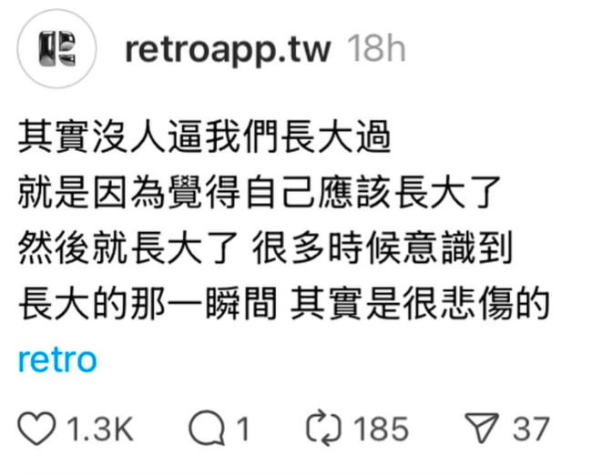

## 放下 Letting go

我最近新认识的一个朋友，分享了他自己的一些经历。他的分享启发了我近期困扰我的问题。自从他的启发后，我从浮躁不安逐渐能够平静下来。我与自己对话，与自己倾听，与自己和解。最后，我发现，其实，我也能放下很多的物与念。

A friend that I recently met shared his past experience. His sharing has led and inspire me to reflect on one of the biggest questions in my life recently. By asking and talking to myself the same question, I find myself calmed my restless mind and able to find peace from voices. Eventually, I realize I could actually let go of many obsession. 

He shared:
> Are the many interests I have beneficial to me? Or am I trying to make myself digestible and relatable to everyone? In search of the validation of others?

> There's one saying that goes
> "Tell God all about your plans in life and watch him laugh at you,"
> 
> Maybe that's why I've tried to not control everything I'm interested in right now, for I'm not a robot; if I'm meant to go on that journey of exploration (interest), it will happen.

I met him on Instagram by chance. I'm still grateful for how a new friend would share words that inspires and were actually helpful for one of my most recent life questions. If you're reading this, thank you so much.

## 心理假 Mental break

同一时候，我正在经历很多情绪和念头淹没的时间。我拿了两天事假，让我精神好好地放松下来。我觉得年轻的我从未想过我会需要这样的假期。步入真实世界以后，我才真正地理解，生活不是每一件事都能够如我所愿。而我要做的不是尝试去控制，而是接受。

我什么时候开始成长呢？我觉得我·我意识，成长的瞬间是孤独的。

### 长大

小时候我对长大成人有一些想象。

但真正步入社会后，我觉得自己长大的瞬间是什么时候呢？

是当我学会面对和消化自己的情绪和疼痛，然后自己心疼自己。

我不是因为有人教我而学会，而是因为，只有我在自己身边陪着自己消化自己的情绪，也只有我可以消化自己的情绪。

年少的我，绝对没有意识到长大原来是这么一回事。

## Little things that touched
### Stories
- [axelschura](https://www.instagram.com/reel/DEju0UGSPhv/)
- [Luke Farritor: Husker wins grand prize for global Vesuvius Challenge](https://www.youtube.com/watch?v=zpflT8XuSyg)
- [🇲🇾 裸辞日记：第八天 - 断舍离 - 小红书](https://www.xiaohongshu.com/explore/67903c59000000002a00f8af?app_platform=ios&app_version=8.60&share_from_user_hidden=true&xsec_source=app_share&type=video&xsec_token=CBMlx2wrsu_5jtUpn9km_h9Y7MDwcgzUBSF_hgAs_Ghkk=&author_share=1&xhsshare=CopyLink&shareRedId=ODhFNjo1PD42NzUyOTgwNjY2OTpIOEs_&apptime=1738823065&share_id=327256ca01884f6abb7f784e26cbb2cd)
### Articles
- [Women’s New Take on Ambition in 2022](https://www.elle.com/life-love/opinions-features/a40835443/women-rejecting-traditional-ambition-2022/)
- [不甘当学渣，努力作学霸，最终是学民](https://halfrost.com/halfrost_2019/)
### Videos
- [Terence Tao on how we measure the cosmos | Part 1](https://www.youtube.com/watch?v=YdOXS_9_P4U)