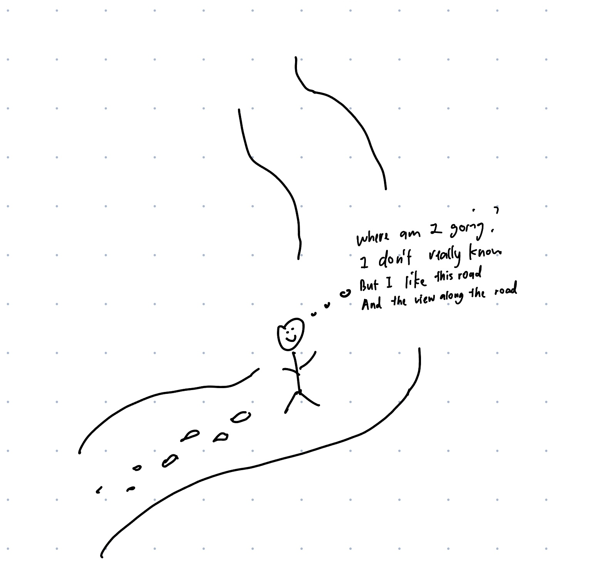

Rewatching La La Land at the critical time in my life.

I first watched La La Land when I was 15 at 2016 when it came out. I always enjoyed it as a musical film.

It's Friday night, I didn't want to think about questions behind my mind, it was pretty random I decided to revisit La La Land. 7 years later rewatching it, as I'm adulting and dealing with adult life, I was finally able to relate how Seb and Mia feel, chasing their dream.

 > City of stars,  
 > There's so much that I can't see
 >
 > Who knows?  
 > Is this the start of something wonderful and new?  
 > Or one more dream that I cannot make true?

I won't talk about any preach nor share any gains, it's subjective to your experience. I just want to jot down what I might have realize from the movie hour tonight, as a note to myself.

1. Perception grows with experience.  
Experience life, you'll be able to relate and resonate with more.

2. It's normal to feel not heading anywhere.  
Complete what you have to do, then you can spend time with what you _like to do_.

3. A little bit of madness is key.

In the end it all boils down to life.  
You'll have your way to experience your own life.  
Learn to live a life. Learn to love life. Learn to _live life_. Then you're be fine :)  
Other prospects are just bullshit.  

 <!-- > Here's to the ones who dream  
 > Foolish as they may seem  
 > Here's to the heart that ache  
 > Here's to the mess we make   -->

