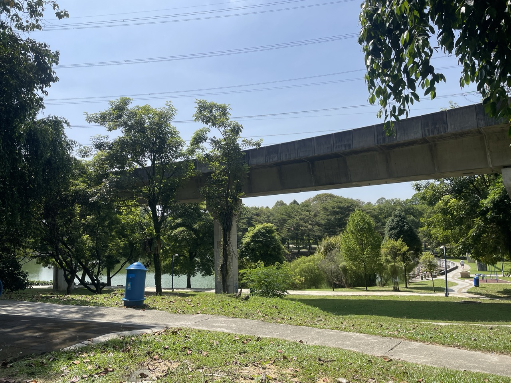
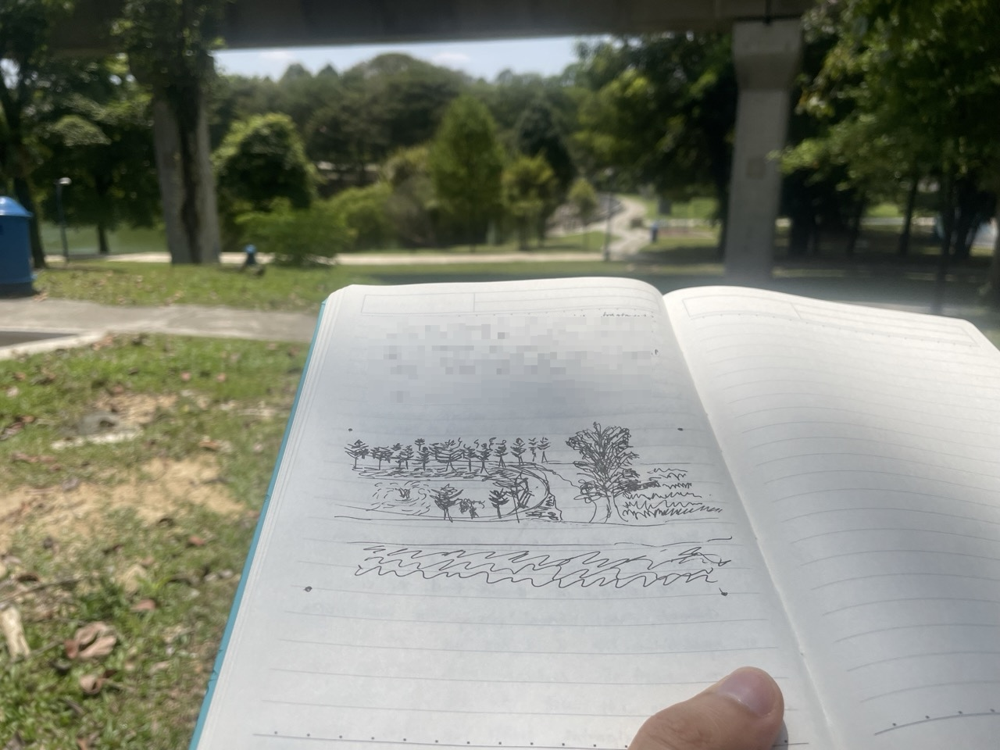
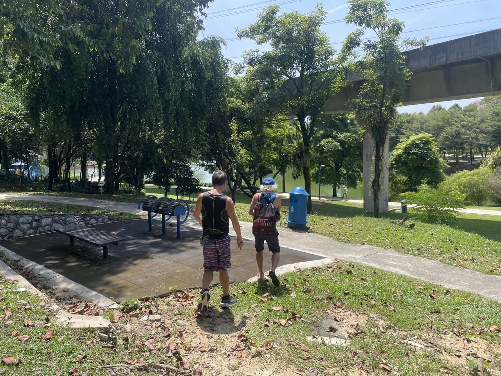

Life has been rough on me the past year. My health, my fitness, my sleep, my living environment, my appetite, my career progress, my expectation for work, my expectation for myself in career, my competency, my skills, my interest, my personal fulfilment, my dreams. None of them look like what I imagined it to be 5 years ago. And because of my health and my sleep, my emotional state, my spiritual wellbeing, my motivation, my drive, they all fluctuate. 

近半年来过得非常不顺利。我的健康，我的身体素质，我的睡眠，我的生活环境，我的食欲，我的事业进度，我对职业的期待，我对事业的期待，我的技能，我的能力，我的兴趣，我的爱好，我的满足感，我的梦想。也因为我的健康，睡眠，也影响了我的情绪调节，心灵健康，工作动力，生活动力，梦想的动力。我现在的状况，并没有像我5年前想象的样子。

Going to the park is the one thing that I always appreciate and grateful for.

I sat on a bench. Looking at the greens, feeling the wind, the sunshine, and sense whatever is happening around me.
I feel wind breeze. 
I hear birds chirp.

I pulled out my journal and started to sketch. Then out of nowhere a man passing by stopped and walked up to me out. Turns out he's an artist, saw me sketching, decided to drop me a hi. He then pulled out his own sketchbook from backpack, put it in my hands, started flipping over pages of his sketches sharing them one by one. I can tell how much he enjoy life from his eyes and how he talks. 

What are the odds? A random passerby, an artist, carrying his sketchbook, saw me sketching, dropped me a hi, we had a wonderful conversation. It just happened.

I remember his words. 

> "Drawing is a therapy."

I couldn't agree more. 

\~~~

I realize I have so much at present.

How can I not appreciate the greens, the trees and grasses? 
How can I not appreciate the sunshine? 
How can I not appreciate the cool breeze of the wind? 
How can I not appreciate all the trees shading me from sun? 
How can I not appreciate the noise as I stepped on dried leaves? 
How can I not appreciate the lake view?  
How can I not appreciate just listening kids laugh and play? 
How can I not appreciate just looking fishers fish? 
How can I not appreciate I not appreciate how many different kind of trees I can see? 
How can I not appreciate that I can see? 
How can I not appreciate that I can walk? 
How can I not appreciate that I can touch? 
How can I not appreciate that I can feel? 
How can I not appreciate that I have rich senses? 
How can I not appreciate that I can experience experiences? 
How can I not appreciate that I'm well educated to able to converse with people? 
How can I not appreciate that I'm appreciate that I have the money, the time, the leisure to just sit and enjoy the view in this park? 
How can I not appreciate that I'm resourceful enough to afford a book, a pen, the time, the leisure to sketch the park view with ease and without stress? 
How can I not appreciate that a kind uncle greeted my morning and encouraged me to sketch? 
How can I not appreciate that a kind uncle showed me his sketches? 
How can I not appreciate I have been to art class and I know what is sketching? 
How can I not appreciate hearing people fish and just looking different people jog? 
How can I not appreciate the noise of people playing basketball? 
How can I not appreciate the noise of people chatting and laughing? 
How can I not appreciate the fact I'm fit enough to walk along the trail surrounded by lively greens and beautiful lake? 
How can I not appreciate the fact I'm able to step on ground and the dried leaves.
How can I not appreciate that I can touch the leaves and the trees? 
How can I not appreciate the fact I can see birds fly? 
How can I not appreciate the rock bench I'm sitting on? 
How can I not appreciate that I'm privileged enough to have a day off, stress free from surviving, able to enjoy a slow morning at a lively beautiful park and having magical encounters? 
How can I not enjoy every breeze of the wind when I know someone else is working hard and stressing over money? 
How can I not enjoy walking the trail when I know someone can't walk? 
How can I not enjoy looking the scenery when I know someone can't see? 
How can I not enjoy my journal, my pen, my gadgets, my belongings when I know someone else can't afford? 
How can I not appreciate the fact I'm living in abundance of resources, matters, peoples, love, kindness, experiences? 
How can I not leave this park not feeling I'm blessed by all means? 

I can't.

All the problems I'm having, all the unsatisfied desires, all the unfinished work, all the unfulfilled yearnings, all the unrealized dreams are so tiny compared to problems other people are having.

