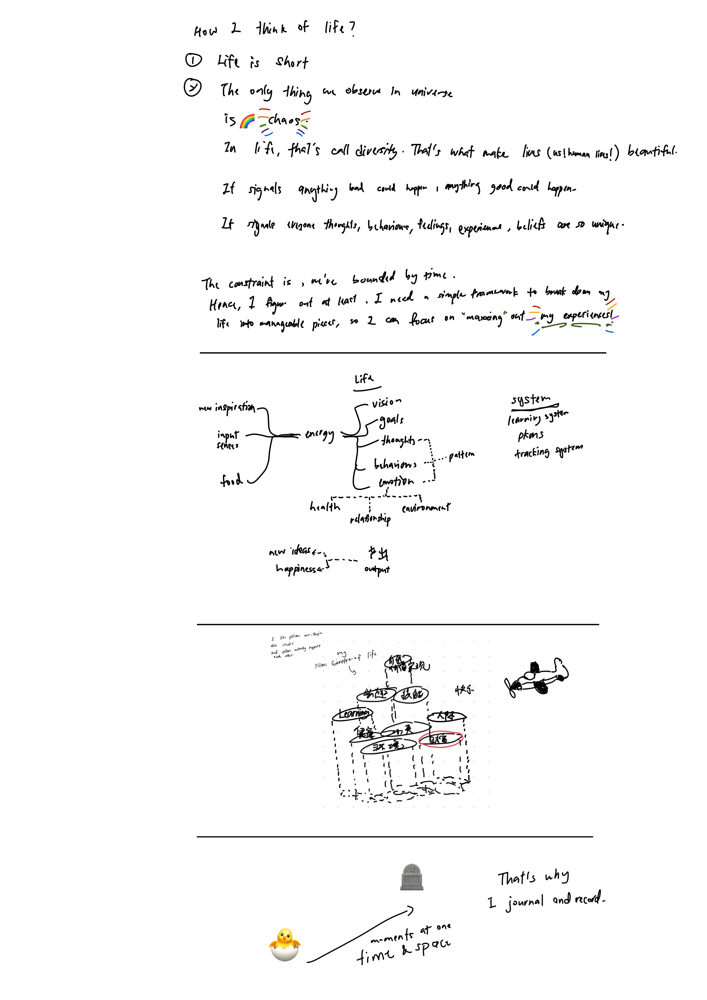

I realized I want to take account of my life, having found a sense of purpose. I want to create a simple framework, that breaks my life into manageable pieces, so I can focus on *maxxing* out *my experiences*.

Here is a prototype. 

I think of humans as closed systems, inspired by a model from Godea. We consume energy, process it, and produce it. To sustain our lives, we rely on interconnected systems.

I’ve also envisioned a framework I call the _pillars of life_, based on Maslow's hierarchy of needs. I imagine these pillars as towering structures, with islands on it representing different aspects of myself. On these islands, I build systems designed to be self-sustaining. A little plane, representing our sense of self, I navigate between these islands, steadily climbing higher and higher. Ultimately, it moves toward the top of the pillars, where my dreams reside and where my pursuit realizes.

Finally, all of these happens in the flow of time, and that's the reason why I started journalling more this year — to capture each moment and make them truly live on. I document what I think, how I feel, and the sensations I experience in those slices of time. 
